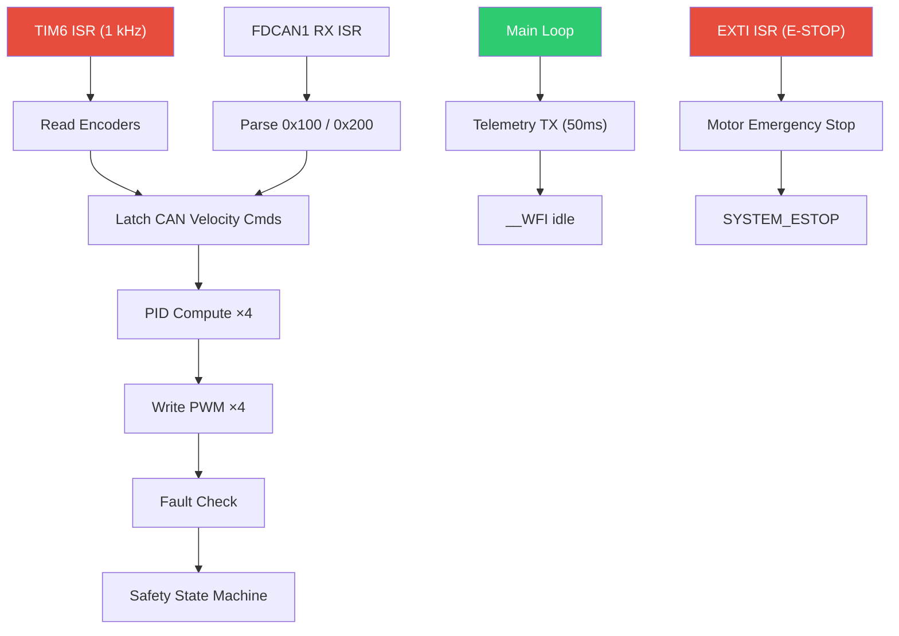
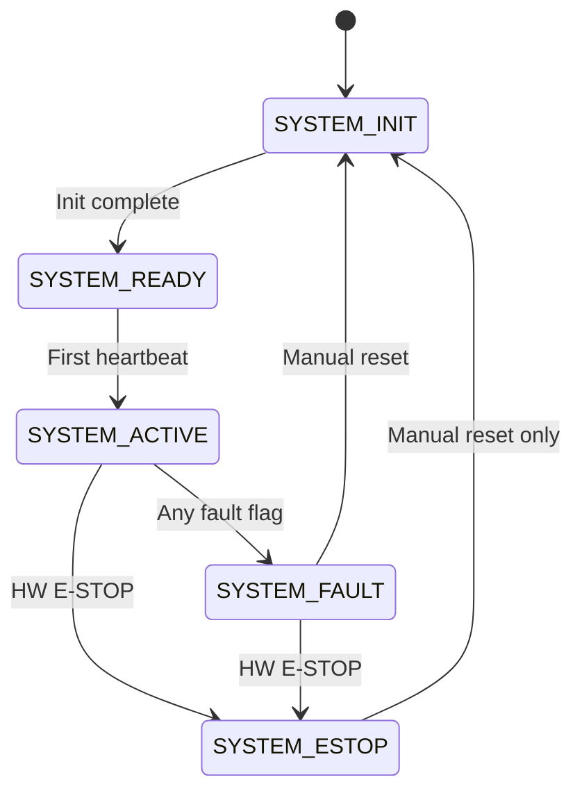

# UGV Firmware Walkthrough — STM32H743ZI

## What Was Built

Bare-metal, safety-critical firmware for a 4-wheel differential-drive UGV on **STM32H743ZI** (Cortex-M7 @ 480 MHz). No RTOS, no dynamic allocation, no blocking delays.

### File Structure (16 files)

```
STM_Code/
├── Core/
│   ├── Inc/
│   │   ├── pid.h
│   │   ├── motor.h
│   │   ├── fault.h
│   │   ├── safety.h
│   │   ├── can_comm.h
│   │   ├── control_loop.h
│   │   └── telemetry.h
│   └── Src/
│       ├── pid.c
│       ├── motor.c
│       ├── fault.c
│       ├── safety.c
│       ├── can_comm.c
│       ├── control_loop.c
│       ├── telemetry.c
│       └── main.c
└── cubemx_config_notes.md
```

---

## Architecture



---

## Key Design Decisions

| Decision | Rationale |
|---|---|
| PID fixed Δt = 1ms baked in | Eliminates timer read overhead; deterministic |
| Velocity as `fabsf()` + direction GPIO | Simplifies PID to operate on magnitude only |
| CAN velocity as `int16 × 100` | Avoids float serialization; ±327 rad/s range |
| Encoder fail counter (100 cycles) | Avoids false triggers from momentary stalls |
| E-STOP at NVIC priority 0 | Preempts everything including control loop |
| `__WFI` in main loop | Idle power saving; wakes on any interrupt |

---

## Safety State Machine



---

## Static Verification Results

| Check | Result |
|---|---|
| `malloc` / `free` usage | ✅ None |
| `HAL_Delay()` usage | ✅ None |
| `printf` in ISR context | ✅ None |
| Blocking `while(1)` in ISR | ✅ None (only in [Error_Handler](file:///e:/Robotics_Team/UGV-Project/UGV_Workspace/STM_Code/Core/Src/main.c#561-574)) |
| All 16 files present | ✅ Verified |

---

## Next Steps (Hardware Testing)

1. Create a CubeMX `.ioc` project using [cubemx_config_notes.md](file:///e:/Robotics_Team/UGV-Project/UGV_Workspace/STM_Code/cubemx_config_notes.md)
2. Remap GPIO pins in [Motor_HW_Config()](file:///e:/Robotics_Team/UGV-Project/UGV_Workspace/STM_Code/Core/Src/main.c#491-540) and [MX_GPIO_Init()](file:///e:/Robotics_Team/UGV-Project/UGV_Workspace/STM_Code/Core/Src/main.c#235-294) to match your PCB
3. Tune PID gains (`Kp`, `Ki`, `Kd`) in [Motor_Init()](file:///e:/Robotics_Team/UGV-Project/UGV_Workspace/STM_Code/Core/Src/motor.c#32-68) on real motors
4. Verify 1 kHz loop with oscilloscope on PB0 debug pin
5. Test CAN-FD with RPi 5 (send 0x100/0x200, receive 0x300/0x400)
6. Pull E-STOP line low → verify immediate motor cutoff
